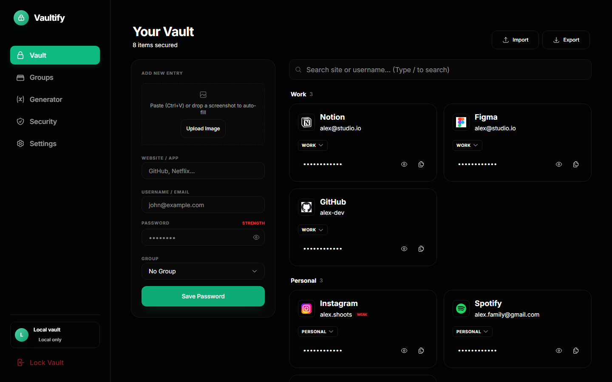
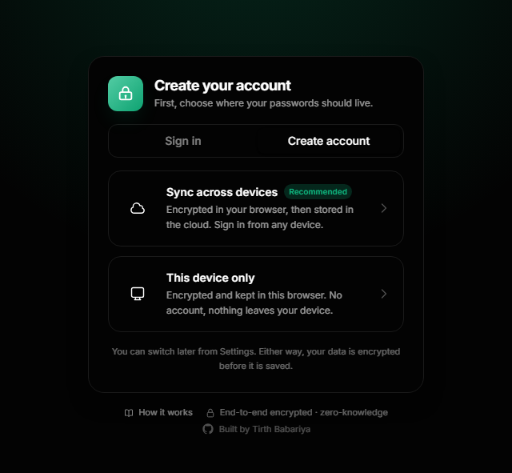
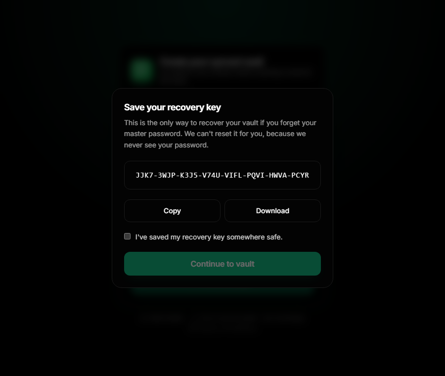
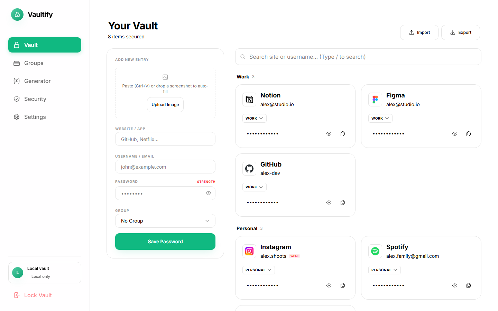
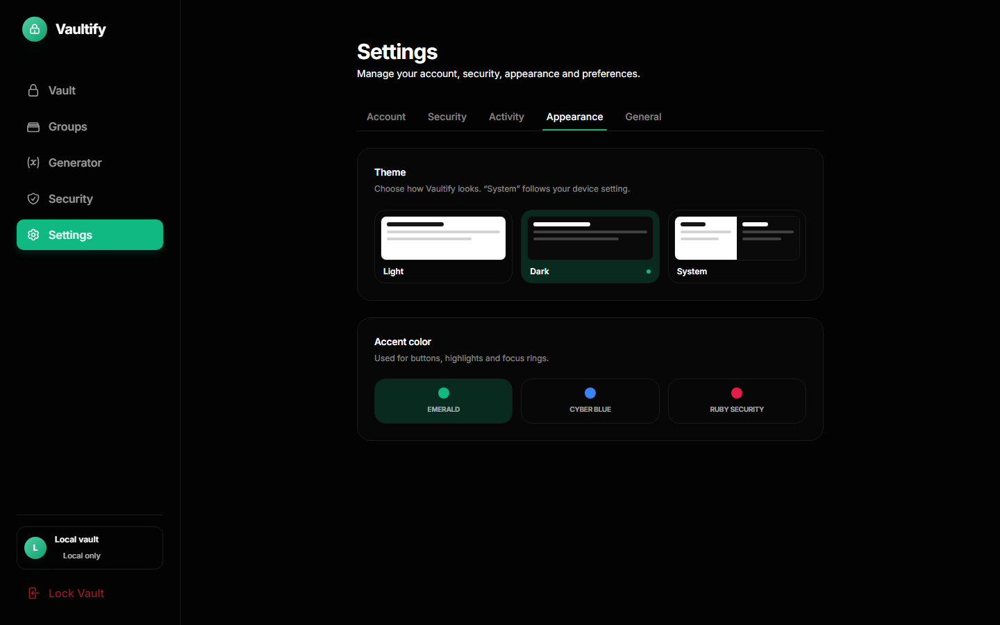
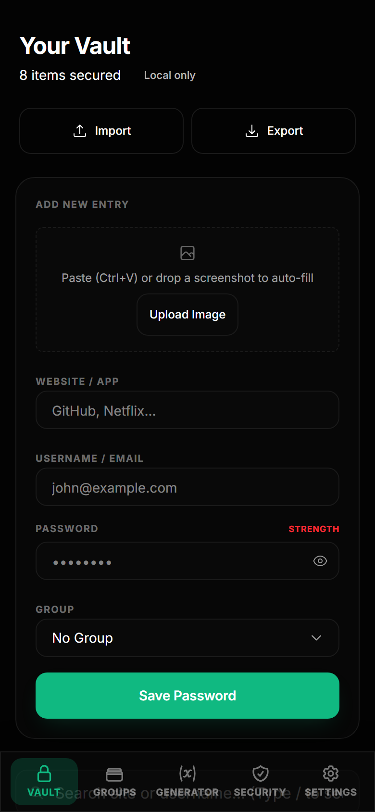
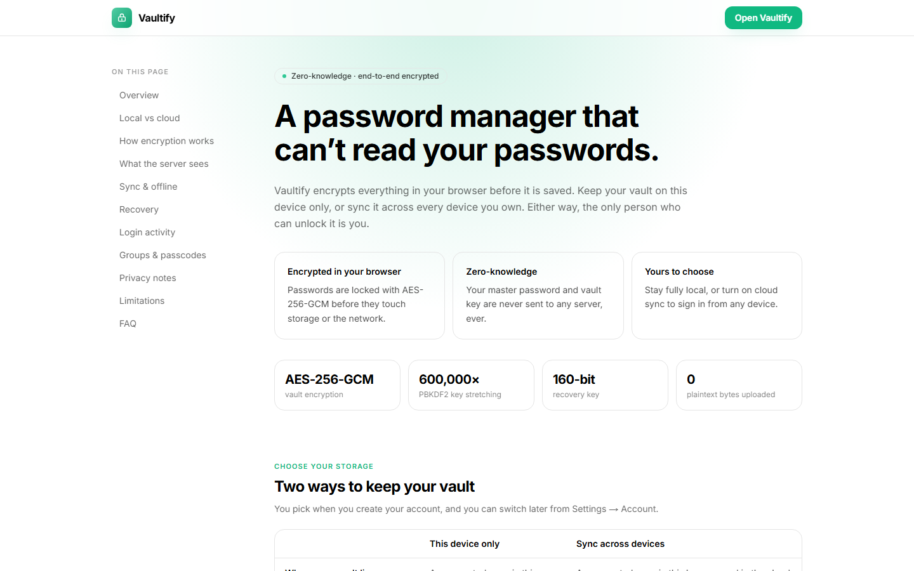
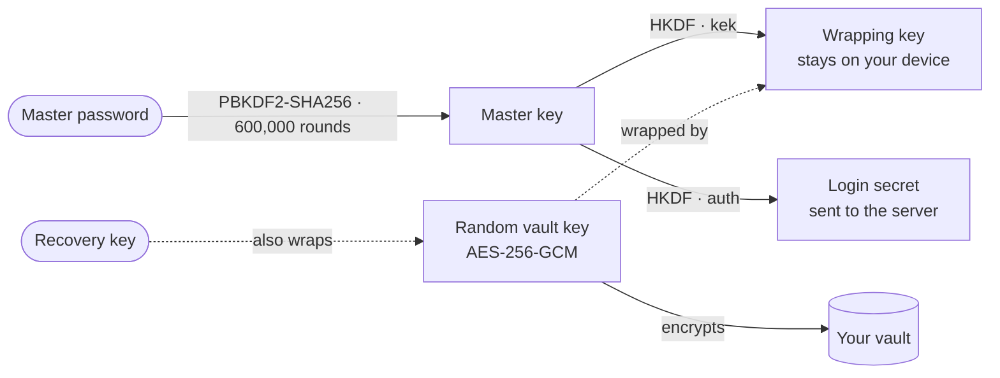
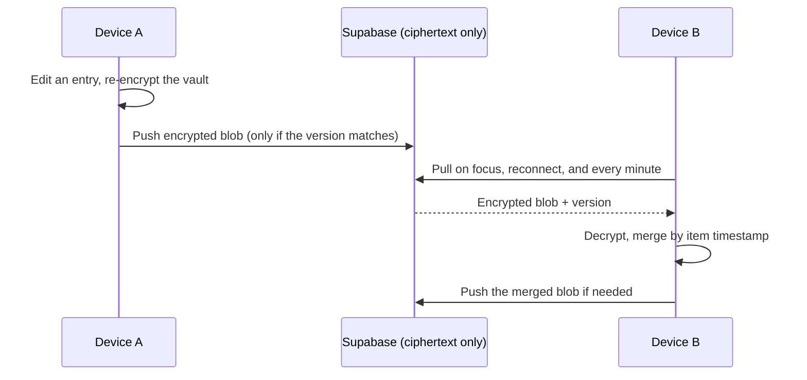

<div align="center">


<br />

[](https://github.com/Tirth-Babariya/Vaultify/actions/workflows/ci.yml)
[](https://nextjs.org)
[](https://react.dev)
[](https://tailwindcss.com)
[](https://supabase.com)
[](LICENSE)
[](#contributing)
[](https://github.com/Tirth-Babariya/Vaultify)

**Zero-knowledge · end-to-end encrypted · works on every device you own**

[GitHub](https://github.com/Tirth-Babariya/Vaultify) · [Quick start](#quick-start) · [How it works](#how-it-works) · [Cloud sync setup](#optional-turn-on-cloud-sync) · [Security](#security) · [Roadmap](#roadmap)

</div>

<br />

<p align="center">
  
</p>

---

## The problem

You have well over a hundred accounts and a brain that reliably holds about seven passwords. So you do what everyone does:

- **You reuse the same password everywhere**, because it is the only thing you can actually remember.
- **You keep a `passwords.txt`**, a note on your phone, or a chat with yourself, right next to your bank login.
- **You click “Forgot password?” every third visit**, then invent a new password you will forget by Friday.
- **You retype credentials by hand from a screenshot** someone sent you, squinting at `l` versus `1`.
- **You’re on your phone and the password is on your laptop.**
- **And if you do use a password manager**, you are asked to hand a company the keys to your entire digital life, and often to pay just to sync between two devices.

It only takes one reused password on one breached site. Attackers replay that email and password against every other service you use, and that is how a small leak becomes a stolen inbox, then a stolen bank account.

The painful part isn’t that good tools don’t exist. It’s that most of them ask you to **trust** someone else with a secret that should never leave your hands.

## The solution

**Vaultify is a password manager that can’t read your passwords.**

Everything is encrypted **in your browser** before it is saved anywhere. You choose where the encrypted vault lives:

| | **This device only** | **Sync across devices** |
|---|---|---|
| Your vault is stored | Encrypted, in this browser | Encrypted, in your browser **and** your own Supabase project |
| Account | None. No email, no sign-up | Email + master password |
| Use it on your phone and laptop | No | **Yes**, sign in anywhere |
| Works offline | Always | Yes, syncs when you reconnect |
| The server can read your data | There is no server | **No.** It only ever stores ciphertext |
| Forgot your master password | Not recoverable | Recover with your recovery key |

No telemetry. No ads. No lock-in. Self-hostable end to end, MIT licensed.

### Why people use it

- **It’s yours.** Open source, and cloud sync runs on *your* Supabase project, so there is no third party in the middle.
- **It’s honest about security.** Read exactly [what the server can and can’t see](#what-the-server-can-and-cant-see), and the [limitations](#known-limitations), in the app itself at `/how-it-works`.
- **It feels like a modern product**, not a weekend project: fast, responsive, dark and light themes, and thoughtful details like screenshot autofill.

---

## Screenshots

<table>
  <tr>
    <td width="50%"></td>
    <td width="50%"></td>
  </tr>
  <tr>
    <td align="center"><sub><b>Two-step sign-up.</b> Pick local or synced, then set your master password.</sub></td>
    <td align="center"><sub><b>Recovery key.</b> The only way back in if you forget your password.</sub></td>
  </tr>
  <tr>
    <td></td>
    <td></td>
  </tr>
  <tr>
    <td align="center"><sub><b>Light and dark.</b> Or follow your system.</sub></td>
    <td align="center"><sub><b>Settings in tabs.</b> Account, security, activity, appearance.</sub></td>
  </tr>
</table>

<p align="center">
  
  &nbsp;&nbsp;&nbsp;
  
</p>
<p align="center"><sub>Fully responsive, with a built-in <b>How it works</b> page that explains the security model in plain language.</sub></p>

---

## Features

### Security
- **AES-256-GCM** encryption for the whole vault, done with the browser’s Web Crypto API.
- **Envelope encryption.** A random vault key encrypts your data. Your master password only unlocks that key, so changing your password never re-encrypts (or re-uploads) your data.
- **PBKDF2-SHA256, 600,000 rounds**, split with **HKDF** into two independent keys: one that never leaves your device, and one used as your login secret. The server never receives your master password.
- **Recovery key.** A one-time 160-bit key that can restore access without the server ever holding a usable secret.
- **Auto-lock** after inactivity, instant **Lock Vault**, and a vault key that lives in memory and this tab’s session only.
- **Login activity** feed (time, device, browser), **sign out everywhere**, and Row Level Security so users can only ever touch their own rows.

### Sync (optional)
- Choose **local-only or cloud** when you sign up, and switch later in Settings.
- **Multi-device merge.** Edit on two devices at once and nothing is lost. Changes are merged item by item, and deletions are remembered.
- **Offline-first.** Keep working without a connection. Changes upload when you’re back.
- Live **sync status** (Synced / Syncing / Offline) and a clear signed-in indicator.

### Everyday quality of life
- **Screenshot autofill (OCR).** Paste, drop or upload a screenshot of a login and Vaultify reads the username and password into the form, entirely on your device.
- **Groups**, each with an optional passcode, and a fast move-between-groups dropdown.
- **Password generator** using a cryptographically secure RNG.
- **Security audit** that flags weak and reused passwords.
- **Smart site suggestions** and favicons as you type.
- **Password-gated, encrypted export.** Exporting asks for your master password every time, and the default backup is an AES-256-GCM encrypted `.vaultify` file. Import supports those plus JSON and CSV. Plus search and keyboard shortcuts (`/` to search, `N` for a new entry).
- **Light, dark or system theme**, accent colours including **RGB Auto**, a lighting mode where the whole interface flows through the colour spectrum (speed and gradient width adjustable), mobile bottom navigation, and subtle mechanical sounds (optional).

---

## Quick start

Vaultify runs in **local-only mode with zero configuration**.

```bash
git clone https://github.com/Tirth-Babariya/Vaultify.git
cd Vaultify
npm install
npm run dev
```

Open <http://localhost:3000>, choose **Create account → This device only**, and set a master password. That’s it.

**Requirements:** Node.js 20.9 or newer.

### Optional: turn on cloud sync

Cloud sync uses [Supabase](https://supabase.com) (the free tier is enough). You run your own project, so the encrypted data lives with you.

1. **Create a Supabase project.**
2. **Create the tables.** Open *SQL Editor*, paste the contents of [`supabase/schema.sql`](supabase/schema.sql) and run it. This creates the `vaults` and `login_events` tables with Row Level Security enabled.
3. **Configure Auth** (*Authentication → URL Configuration*):
   - **Site URL:** `http://localhost:3000` (your production URL when you deploy)
   - **Redirect URLs:** add `http://localhost:3000/recover` (and `https://your-domain/recover` for production)
4. **Decide on email confirmation** (*Authentication → Sign In / Providers → Email*). Vaultify supports both. Supabase’s built-in email sender has a low rate limit, so configure your own SMTP before real users sign up.
5. **Add your keys.** Copy [`.env.example`](.env.example) to `.env.local` and fill it in from *Project Settings → API*:

   ```bash
   NEXT_PUBLIC_SUPABASE_URL=https://your-project-ref.supabase.co
   NEXT_PUBLIC_SUPABASE_PUBLISHABLE_KEY=sb_publishable_xxxxxxxxxxxxxxxx
   ```

   > The publishable (anon) key is designed to be public: your data is protected by Row Level Security and by encryption. **Never** put a `service_role` key in this project.

6. Restart `npm run dev`. **Sync across devices** is now selectable when you create an account.

### Deploying

Vaultify is a Next.js app with no server code of its own, so it deploys anywhere Next.js does. On [Vercel](https://vercel.com): import the repo, add the two environment variables, then add your production URL and `/recover` path to Supabase’s redirect URLs.

---

## How it works



1. You type your master password. It never leaves the browser and is never stored.
2. It is stretched and split into a **wrapping key** (kept local) and a **login secret** (what the server sees instead of your password).
3. The wrapping key unlocks a **random vault key**, which encrypts everything: entries, groups and settings.
4. Local mode keeps that encrypted blob in your browser. Cloud mode uploads the *same* blob.
5. On another device, signing in derives the same keys, downloads the blob and decrypts it locally.

### Sync across devices



If two devices push at once, the second is rejected by a version check, re-pulls, merges (newest edit wins per item, deletions are tracked) and pushes again, so neither device’s changes are lost.

### What the server can and can’t see

| The server can see | The server can never see |
|---|---|
| Your email address | Your master password |
| That a vault exists, roughly how large it is, and when it changed | Your vault key or recovery key |
| Sign-in events (time, browser, OS) | Any site name, username or password |
| A derived login secret (not your password) | Your groups, passcodes or notes |

A full database leak exposes only ciphertext.

---

## Security

> **Vaultify has not been independently audited.** It is built on standard, well-reviewed primitives (Web Crypto API), but the implementation as a whole has not had a professional security review. Treat it as beta software, keep a backup of anything important, and do not rely on it as the only copy of critical credentials.

### Known limitations

- **A compromised device wins.** Malware, keyloggers or a malicious browser extension can see what you type and what’s on screen.
- **Your master password is the last line of defence.** If someone obtains your encrypted vault, key stretching slows guessing but can’t rescue a weak password. Use a long passphrase.
- **While unlocked**, the vault key is held in memory and in the tab’s `sessionStorage` (so a refresh doesn’t lock you out). It’s cleared when you lock or close the tab.
- **Group passcodes are a convenience lock in the UI**, not separate encryption. All groups share the vault key.
- **Email account takeover** can’t reveal your data, but could let an attacker wipe your cloud copy. Keep a local export.
- **Lose your master password *and* recovery key and the data is gone.** That’s the trade-off of zero-knowledge.
- **Plain JSON export is still available** for moving to another app. It is unencrypted, so store it carefully and delete it afterwards. The default export is encrypted.

### Privacy notes

- **OCR runs in your browser.** Screenshots are never uploaded. The OCR engine downloads its language data from a public CDN on first use.
- **Site icons** are requested from Google’s favicon service for well-known sites and domains you type. That reveals the *domain*, never credentials. Unrecognised names show the Vaultify icon and make no request.

Found a vulnerability? Please read [SECURITY.md](SECURITY.md) and report it privately.

---

## Testing

```bash
npm test          # fast unit tests: crypto, key wrapping, recovery keys, merge logic (Node 20.19+)
npm run test:e2e  # real-browser tests against a fake Supabase (run "npx playwright install chromium" once)
```

The end-to-end suite builds the app against a **mock backend**, so it never touches a real Supabase project. It covers sign-up with email confirmation, recovery, multi-device sync and conflict merging, offline edits, migration of old vaults, themes and settings tabs, and that every auth screen fits without scrolling. It also asserts that the server never receives a master password, recovery key or plaintext entry.

Both run automatically on every push and pull request via [GitHub Actions](.github/workflows/ci.yml).

## Project structure

```text
src/
├── app/
│   ├── page.js              Dashboard (vault, groups, generator, audit, settings)
│   ├── lock/                Sign in · create account · unlock
│   ├── recover/             Password-reset + recovery-key flow
│   └── how-it-works/        Plain-language security explainer
├── components/              UI: LockScreen, Sidebar, PasswordForm, SettingsView, …
└── lib/
    ├── crypto.js            Web Crypto: PBKDF2, HKDF, AES-GCM, key wrapping
    ├── vaultStore.js        In-memory vault, local persistence, lock/unlock, migration
    ├── vaultData.js         Vault shape + conflict-free merge
    ├── cloud.js             Supabase auth, sync engine, recovery, mode switching
    ├── activity.js          Login / security activity feed
    ├── ocr.js               Screenshot → credentials (Tesseract.js, on-device)
    └── theme.js             Light / dark / system
supabase/schema.sql          Tables + Row Level Security policies
tests/                       Unit tests (crypto, merge) and Playwright end-to-end suites
docs/                        Banner and screenshots
```

**Stack:** Next.js 16 (App Router) · React 19 · Tailwind CSS 4 · Web Crypto API · Supabase (optional) · Tesseract.js

---

## Roadmap

- [ ] Built-in 2FA (TOTP) codes per entry
- [ ] Secure notes, cards and identities
- [ ] Breach check using k-anonymity (only a hash prefix leaves the device)
- [x] Encrypted export / import (master-password gated)
- [ ] Import from other password managers
- [ ] Passkey / WebAuthn unlock
- [ ] Installable PWA
- [ ] Browser extension for autofill
- [x] Automated unit and end-to-end tests, run by GitHub Actions on every push
- [ ] Independent security review

Have an idea? [Open an issue](../../issues).

---

## Contributing

Contributions are very welcome, especially tests, accessibility improvements and security review.

1. Fork the repo and create a branch.
2. `npm install && npm run dev`, then make your change.
3. Run `npm run build` and make sure it passes.
4. Open a pull request describing **what** and **why**. For anything touching `crypto.js`, `vaultStore.js` or `cloud.js`, please explain the security reasoning.

Please never commit secrets. `.env*` files are git-ignored.

## License

[MIT](LICENSE) © Tirth Babariya

<div align="center">
<br />

**If Vaultify saves you from one more “Forgot password?”, consider giving it a ⭐**

<sub>Built with care by <a href="https://github.com/Tirth-Babariya">Tirth Babariya</a></sub>

</div>
